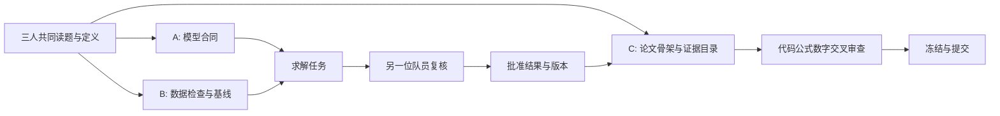

# 三人协作与 AI 任务交接

以下是建议，可以根据队员能力调整。不能让任何人只负责复制 AI 输出。

| 角色 | 主责 | 交付 | 交叉检查 |
|---|---|---|---|
| A 模型与决策 | 题意、假设、目标、约束、模型比较、取舍 | 模型说明、符号单位表、依赖图 | 复核 B 的数值与约束 |
| B 数据与求解 | 清洗、实现、试验、复现、运行时间 | 脚本、数据字典、结果表、日志 | 检查 C 正文与实际代码一致 |
| C 论证与交付 | 问题覆盖、文献证据、同步写作、匿名与材料 | 章节草稿、证据索引、最终包 | 检查 A 的假设是否足以支持结论 |

C 应能运行既有脚本、解释主要结果；A 应能手算小样例、看懂关键代码；B 应能说清模型适用边界。若三人都能编程，则每人负责一个可独立交付的模型模块，仍保留 A 总体决策、B 数据接口、C 主稿整合职责。角色不是能力标签，不按性别或专业刻板分配。

## 实际并行图



AI 会话按任务分，不按“万能队友”分。一个任务只负责一个能验收的产物。例如 A 的会话比较两个目标函数并找反例，B 的会话实现已确定模型，C 的会话依据批准结果写某一节。等待数据时 C 可以完善题意覆盖和符号说明，不能先编写结果结论。

## DAG 派单模式（读题完成后）

Stage 2 拆解产出 `subproblem_dependency` 后，进入任务图派单：任务为有向无环图节点，按角色认领。规范：

- `scripts/task_dag.py init --workspace <project>` 从拆解结果生成骨架图（每问 model(A)→solve(B)→verify(交叉)→write(C)，加全局基础/数据/骨架根节点和稳健性/摘要汇聚点）。骨架是起点不是强制，队伍用 `add`/`replan` 按实际调整。
- **派单看板**：`task_dag.py board` 列出就绪任务（依赖全部 done）、进行中、受阻原因，按 A/B/C 分工认领。一次认领一个，`update --status in_progress` 后开工。
- **完成门槛**：`update --status done` 需复核回执——复核人必须 ≠ 负责人角色，含 `reviewed_at`/`evidence`/`checks`/`artifacts`，产物记 SHA256。
- **保留调整余地**：方向变化时 `replan` 增删改任务（记 reason，dag_version 递增，历史不删除）；上游结果作废时 `invalidate --task <id>` 级联标 stale（下游全部失效但保留产物与历史），`check` 检测已完成任务的产物漂移并提示级联重做。已完成任务不能取消，只能失效重做，保证下游可追溯。
- 硬约束由脚本校验：无环、依赖存在、同路径单写者、复核人 ≠ 负责人。取消一个仍被依赖的任务是允许的（会把下游留在 blocked 状态），replan 时应同步处理其下游。
- 三个根任务（基础层、数据检查、论文骨架）无依赖可立即三人并行开工；每问四任务形成局部链，问与问之间按依赖图并行。

对 Q1→Q2→Q3 的依赖：先明确输出字段、单位和误差传播。Q2 可用手工小样例测试接口，正式结果必须在 Q1 版本批准后重跑；不能把临时数值混入最终论文。若 Q2/Q3 真正独立，才分开实现——这一点在 Stage 2 的 `subproblem_dependency` 中写明，DAG 骨架会据此生成并行分支。

## 文件与版本约定

可适配已有工程，建议：

```text
problem/                  题面
data/raw/                 原始附件，只读
data/processed/           带处理记录的数据
models/                   假设、符号、接口
src/                      可运行实现
runs/<run-id>/            参数、日志、结果、图表
paper/                    主稿与章节
state/decision_log.json   v2 唯一主状态，总协调人写
tasks/<task-id>/           任务卡与交接
logs/ai/                  实际使用记录，内部原始记录分开保存
delivery/                 冻结文件
```

同一时间每个文件只有一个写入者；并行任务各写自己目录。C 整合主稿，B 发布批准的数据接口，A 或指定协调人更新总状态；不能让多个 AI 同时覆盖状态 JSON。版本控制可用本地 Git 和明确的分支/工作目录，也可用队内离线版本包。正式比赛不把赛题相关内容发布到公共仓库或向队外共享。

结果记录至少包含：run_id、数据指纹、代码版本（无 Git 则文件哈希）、配置、随机种子（如适用）、运行命令、关键结果文件、验证结果、复核人代号。草稿图和最终图必须能区分。参数、清洗、公式有变化时，标记依赖结果及文稿失效并重算。

## 时间与算力

- 建议每 2—3 小时用 10 分钟同步，仅讨论完成项、阻塞项、接口变化和下一产物；关键定义变化立即同步。
- 新模型先用 20—30 分钟做可行性试跑，复杂优化先小规模。正式实验设时间/内存上限和检查点，不同时让多个代理修改环境或争用全部 CPU/GPU。
- 默认同一小问一条稳定基线加一条有理由的改进，不开展十个没有验证计划的模型分支。
- 两次尝试仍没有可判定改善时，复盘假设、数据、指标和代价，再决定继续/降级/放弃；不是机械最多两次重试。
- AI 额度下降或网络故障时，使用已落盘的任务卡、数据和基线继续工作；删减候选探索与语言润色，保留代码运行、人工验证与交付。不预测具体厂商可用额度。

## 人工主导的五个关键决策

选题与范围；核心假设/模型选择；批准结果；论文结论与局限；最终提交文件。用户已经确认或团队已有决定时不重复询问。无需把例行代码修错、已批准图表排版变成一轮轮审批。关键决策到来时，给出具体备选及证据，让队员能够判断。

交接摘要使用 `assets/task-card.md` 的字段；每人休息前写清已完成、下个命令、已知问题、禁用的旧结果。三人共同睡眠时不要安排需要即时答复的任务。
